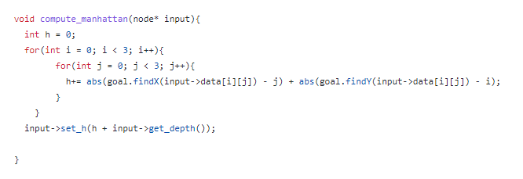
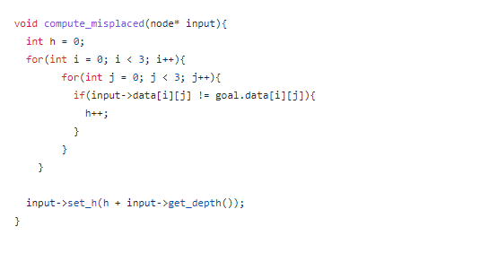
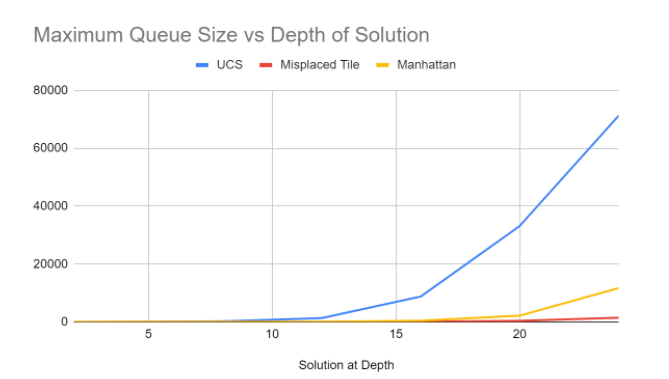
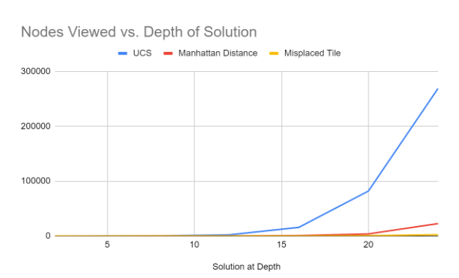
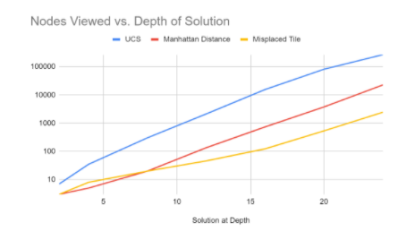

# The Problem
The 8 puzzle is a popular puzzle that we used as an example throughout the first half of CS170. In the puzzle there are 9 slots (a 3x3 matrix) to place blocks numbered 1-8, since there are only 8 blocks and 9 slots there is an empty slot. You can slide a block adjacent to the empty space into the empty space thus creating a new empty space but you cannot swap two blocks. 

This assignment is the first assignment in Dr. Eamonn Keoghs CS170: Introduction to Artificial Intelligence at UC Riverside. In it, we are told about the 8-puzzle and instructed to create an A* search using 3 different heuristics to solve the problem. It is up to us to decide how to represent the problem space and the operations and code the heuristics, but we are given a pseudocode of how a general search algorithm works to follow. I made my project in C++ using the standard C++ library. I created 2 classes, puzzle and node to represent the problem. Puzzle stores the current state of the puzzle and the general search algorithm including the various heuristics. Node stores an individual state of an 8 puzzle.

A* search is a search algorithm that adds unvisited nodes to a queue in order of a value f(n) that assesses how close it is to the solution while considering how far it is from the start. f(n) is the sum of h(n), the value of a heuristic that is created by the programmer and g(n), the distance from the starting node. Since this algorithm is optimal and complete, the only way to create a better search is to create better heuristics. In this project, we see how impactful a heuristic is on runtime and space complexity by comparing 3 different heuristics. 

# Heuristics
### Uniform Cost Search:
The h(n) value in the Uniform Cost Search algorithm is 1 regardless of the state that the puzzle is in. This means that the f(n) is only contingent on the depth of the node, and the search algorithm will be equivalent to breadth first search. This is an expensive heuristic in terms of runtime and space complexity. 

### Manhattan Distance: 
The h(n) value in the manhattan distance heuristic is the sum of each tiles distance from its desired location.

For example, if we have a state:
[1, 2, 8],
[4, 5, 6],
[7, 3, 0]

The only two tiles out of place are the 8 and the 3, they are both 3 moves away from their goal location, so the h(n) = 3+3 = 6.

Here is my code for computing the manhattan heuristic value given a node and a goal state (stored in the puzzle class):

### Misplaced Tile: 
The h(n) in the misplaced tile heuristic is simply the number of tiles that are not in their goal location. 

For example, if we have a state:
[1, 2, 8],
[4, 5, 6],
[7, 3, 0]

The 3 and the 8 are the only tiles out of place, so the heuristic value (h(n)) is 2.

Here is my code for computing the misplaced heuristic of a state given the goal state. 

# #Comparison
I measured a couple of different ways to compare the three heuristics: nodes viewed and maximum queue size. I also measured the runtime with the c++ ctime library. I also noticed that when I used the greedy algorithm (f(n) = h(n) instead of f(n) = h(n) + g(n)) I got lower runtimes at the cost of losing optimality. I also tried each heuristic with/without checking for repeated states. Without checking for repeated states in the manhattan and misplaced tile heuristics, the search loop would get caught between two states for most problems inputted past a depth of 8 or so. Without checking for repeated states, the UCS heuristic still performed similarly, just had a larger number of nodes visited (expectedly). I didn’t measure data for the greedy algorithms or data on the heuristics without checking for repeated states because it seemed futile and unnecessary, but thought I’d note that I tried both of these (at first unintentionally) and they changed the complexity in expected ways. 

Figure 1. Maximum Queue Size vs. Depth of Solution. As we can see, the heuristics can massively improve the space complexity of A*. This is less relevant in problems with shallow search spaces, however, as the search space becomes larger, the difference between space demands of heuristics grows. 

Figure 2. Nodes Viewed vs. Depth of Solution. This is a good approximation of runtime complexity. Once again the heuristics outperform a breadth first search and become more important in deeper problems. 

Figure 3. Nodes Viewed vs. Depth of Solution in log scale. In log scale, we can see that the misplaced tile begins by being outperformed by the Manhattan distance heuristic, but once the search space reaches ~10 nodes, the misplaced tile heuristic is better.

# Code and Outputs
Here is an example code traceback: https://pastebin.com/KTuSBms9

# Conclusion
In this project, I coded the problem space for the 8 puzzle and explored 3 different heuristics in an A* search to assess their problem solving capability and learn the importance of heuristics. In more complex problems, heuristics can become more complex, but since A* is optimal and complete, the only way to improve speed without compromising optimality or completeness is to improve your heuristics. 

By comparing the runtime and space complexity of the three different heuristics, we can see that for shallow search problems, optimal heuristics aren’t necessary. However, as problems become more complex and search spaces become deeper, advanced heuristics are necessary to save time and space. 
